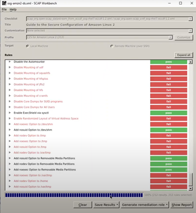

# Initial Security Approaches for AWS Cloud Environment 
## Table of Content

**1.0 Introduction**
+ 1.1	Your responsibilities  
+ 1.2	Cloud provider responsibilities
+ 1.3	Detailed Examples of shared security management responsibilities between you & AWS:
 * 1.3.1	AWS Lambda (Severless Functions)
 * 1.3.2	AWS Fargate (Serve less Containers)
 * 1.3.3	Amazon ECS/EKS  (Container management as a service)
 * 1.3.4	Amazon EC2 (Infrastructure as a service)		
 
**2.0	Potential Vulnerabilities that Exist Surrounding your Container**
+ 2.1	Images that you use to build your containers.
+ 2.2	Image registries that you use to store the images. 
+ 2.3	Container runtime that you use to execute your containers. 
+ 2.4	Orchestration platforms which you use to manage life cycle of multiple containers with.
+ 2.5	Host OS. 	

**3.0	Tools to for Security**
+ **3.1 Scanning Tools Category**
  * 3.1.1 AWS ECR (Clair)
  * 3.1.2 Docker Bench
  * 3.1.3 OpenScap for AWS (Security Content Automation Protocol)
  * 3.1.4 DevSecOps for the applications 
  > * 3.1.4.1 AWS CodeCommit
  > * 3.1.4.2  Software Composition Analysis (OWASP Dependency Check)
  > * 3.1.4.3 Static Analysis Security testing (SAST) Sonarqube 
  > * 3.1.4.4 Dynamic Analysis Security Testing (DAST) OWASP ZAP

+ **3.2	Monitoring Tools Category**  
  * 3.2.1  AWS CloudWatch
  * 3.2.2 Prometheus 
  * 3.2.3 AWS CloudTrail 
  * 3.2.4 AWS Config  
  * 3.2.5  Datadog:  
 
+ **3.3 AWS Firewall Tools Category**
  * 3.3.1  Activate AWS Shield
  * 3.3.2  Activate AWS WAF

+ **3.4	AWS Backup & Restore Tools Category (Apps, DBs, etc )**
+ **4.0	Compliances Planning**

+ **5.0	Extra: Red Team approach**

# Initial Aecurity Approaches for AWS Cloud Environment 
## 1.0	 Introduction
Cloud Security is a shared management responsibility between you and the cloud provider.
### 1.1	Your responsibilities  
You secure the applications, workloads, and data you bring to the cloud. 
You secure data encryption, and key management using the hardware security module HSM.

### 1.2	Cloud provider responsibilities
Manages security of the entire Cloud platforms, compliance and securing network such as down and run time and isolations.

### 1.3	Detailed Examples of shared security management responsibilities between you & AWS: 
#### 1.3.1	AWS Lambda (Severless Functions)
##### AWS manages: 
+ Data Source integrations, physical hardware, software, networking, provisioning
##### You manage: 
+ Application code

#### 1.3.2	AWS Fargate (Serve less Containers)
##### AWS manages:
+ Container orchestration, provisioning, cluster scaling, physical hardware, OS/kernel, networking and facilities. 
##### You manage: 
+ Application code, data source integration, security config and updates, networking config, and management tasks.

#### 1.3.3	Amazon ECS/EKS  (Container management as a service)
##### AWS manages: 
+ Container orchestration control plane, physical hardware software,  networking and facilities.
##### You manage: 
+ Application code, data source integration, security config and updates, networking config, management tasks, firewall, and work clusters.

#### 1.3.4	Amazon EC2 (Infrastructure as a service)
##### AWS manages: 
+ Physical hardware software,  networking and facilities.
##### You manage: 
+ Application code, Data source Integration, security config and updates, networking config, management tasks, firewall, scaling and patching of servers. 

## 2.0	Potential Vulnerabilities that Exist Surrounding your Container

### 2.1	Images that you use to build your containers.
- Keep the images up to date (so we will have the latest security patches of the vulnerabilities)
- Scanning the images to detect new vulnerabilities and validation secure images. 
- Signing your images will essentially create a digital fingerprint  that you can use. 

### 2.2	Image registries that you use to store the images. 
Potential vulnerability because they contain all the images which contain you application code.
-	Keep it private: how many images you have, private access control of the users accessing the registry 
-	Regularly monitoring your registry: so you can track any vulnerability that come out.
-	Make sure host server for the registry is secure: so you can protect it from being compromised to protect your images and applications.

### 2.3	Container runtime that you use to execute your containers. 
-	Ensure Apps security 
-	Monitor you network protocols and network resources. 

### 2.4	Orchestration platforms which you use to manage life cycle of multiple containers with
-	Limiting the number of Privileged users 
-	Limiting the amount of Privilege that you give any user.   
-	Monitoring your Orchestration platform as well as your resources.

### 2.5	Host OS
which manages the Docker client, Docker daemon and the Kernel that is shared with our running Docker Containers.
It is one of the greatest vulnerabilities you can have in you container environment is compromised, the attacker will access your entire application environment.
-	Monitor the host.
-	Access Control.
-	Regularly, monitoring the OS and ensure patching against the updated vulnerabilities 

## 3.0	Tools to for Security 
### 3.1 Scanning Tools Category
#### 3.1.1 AWS ECR (Clair): Performs static scanning  for Docker images prior to deployment .

### 3.1.2 Docker Bench: is a simple script that will test your container against dozens of container production deployment best practices such as: 
-	Do not run the container as root  default option and ensure a user has been created.

### 3.1.3 OpenScap for AWS (Security Content Automation Protocol): will allow you to create schedules around continuous scanning for your container   
-	Managing vulnerabilities and validating compliance.
-	Automatically scan technology for vulnerabilities  and authorized changes in security configurations. 
-	Configuration monitoring.
-	Reduce Cyber Risk.
-	Remediate problems to restore security controls to your established security configuration.

### 3.1.4 DevSecOps for the applications 
Securing the application after it is completed or launched in the market is a nightmare for developers and security team as well as the companies. This expose companies to the risk of attacks, losing money, reputation loss, government fines, spending a longer time and delay the new releases of the applications. From these issues we consider invoking security inside DevOps life cycle as the best security practice when we develop the apps. Now let’s dive to basic DevSecOps Culture. 

#### 3.1.4.1 AWS CodeCommit
-	To be sure the developer does not push any of the secret keys in plain text into git repository. 
-	Allow specific developers access to your repositories using (IAM roles). 
-	Transfer the files to and from AWS using  HTTPS or SSH.
-	Encrypted AWS Key Management Service (AWS KMS).

#### 3.1.4.2  Software Composition Analysis (OWASP Dependency Check)
Because nowadays we are writing 20% of the code only while the rest of the code are open source libraries and components, we use many vulnerable dependencies those dependencies are a real threat to our code.  Therefore, we should use OWASP Dependency Check.

#### 3.1.4.3 Static Analysis Security testing (SAST) Sonarqube: 
To investigate your code in a build stage for SQL injections, XSS, insecure libraries etc. Sonarqube is easy to use and supports Multi-language and detects more tricky issues comparing to PHPStan.

#### 3.1.4.4 Dynamic Analysis Security Testing (DAST) OWASP ZAP:
to investigate your code during the run environment of the apps, in this stage we will find the bugs and vulnerabilities appears when the app is running. 

## 3.2	Monitoring Tools Category  
### 3.2.1  AWS CloudWatch: Collect, monitor and analyze applications health 
Visualize and analyze different metrics for your resources, receive alarms or auto-scale your resources automatically using AWS CloudWatch to monitor your resources in a single view. It will provide you also with CloudWatch Anomaly Detection feature on metrics. AWS CloudWatch Anomaly Detection applies machine learning algorithms to continuously analyze metrics of systems and applications to determine normal baselines and surface anomalies with minimal user intervention. You can create alarms based on a metric's expected value, these types of alarms don't have a static threshold for determining alarm state, instead, they compare the value of the metrics to the expected value based on the anomaly detection model.

-	It is recommended for startups to use monitoring in reactive mode (sending an Alarm when your resources are struggling).  They can have visibility in the system through a set of metrics and dashboards. After growing they can move to a proactive approach of a self-healing system (auto-scaling for the resources when your resources are struggling) to achieve operational excellence.  
-	Resource monitoring is critical to the health of any business, use Amazon CloudWatch metrics to monitor resources. Use CloudWatch alarms to generate alerts and create Dashboards.

### 3.2.2 Prometheus: amazon managed service for Prometheus with Grafana cloud agent  AWS
Prometheus is open source and can be integrated with the AWS platform and it is recommended to use it for monitoring large infrastructure that contains multiple applications with different services. 

### 3.2.3 AWS CloudTrail  
Capture and consolidate user activity and API usage across AWS Regions and accounts on a single, centrally controlled platform.  To determine Who performed what actions and when on your resources. Effective tool.

### 3.2.4 AWS Config 
monitor and record history the changes of all configuration changes of your AWS resources.

##### AWS Config and CloudTrail do overlap. They both monitor services that track and record changes to AWS resources. They also have similar applications, such as operational issue troubleshooting and security analysis.
##### Both services also offer integration with CloudWatch Events, which enables developers to configure actions based on specific events.
##### But the tools take a different approach to monitoring. CloudTrail focuses on who made the specific change, when and from where. Config zeroes in on how the resource has changed. The recommendation is to enable both services, particularly in AWS accounts with applications in a production environment, or those with a high number of resources or team members.

-	When it comes to large enterprises then easier insights and views, people may consider Dynatrace and Datadog
-	Both Dynatrace and Datadog are highly specialized in infrastructure monitoring, application performance monitoring (APM) and log analysis 

### 3.2.5  Datadog:  Monitor Your AWS, Easy to use  third party commercial. 
Fantastic vendor, great product suite, a winning combination for your Application Performance Monitoring (APM) needs, infrastructure and  beyond.
Above Average product, but feels expensive
Market rating: 4.5/5  (425 Ratings)

### 3.2.6  dynatrace: Monitor Your AWS, Easy to use  third party commercial.
The most popular platform for automatically observing application and Infrastructure efficiency.
For monitoring and testing the load on the system this tool is very efficient.
Market rating: 4.6/5 (1344 Rating)

###### When we compare dynatrace to Datadog, dynatrace is more preferred. However, in terms of security and privacy, the tools from third-party agents outside the AWS platforms such as dynatrace & Datadog are not recommended. As all providers always say “do it at your own risk”.

## 3.3	AWS Firewall Tools Category 

### 3.3.1  Activate AWS Shield: 
Protects against DDoS attack 24/7.
### 3.3.2  Activate AWS WAF: 
Provides protection for the web applications from OWASP top 10 and well-known vulnerabilities. WAF monitors and protects applications and APIs built on services.

##### Note: to configure AWS-WAF you can use the Cloud Formation tool in AWS  to automate the creation of the resources we need in Amazon web services through a template.  

## 3.4	AWS Backup & Restore Tools Category (Apps, DBs, etc )
-	Create backup plan (Immediately/scheduled)  & Assign resources 
-	Check restore backups.

##### Build a new plan 
choose the frequency of the backup rules (Custom, every 12 hours, daily, monthly, yearly based on how the organization might need it).Choose when the backup transit to cold storage and when to expire.

##### Assign resources and databases 
Choose all the resources associated with application.
IAM role to create a backup , or use the default role (it will follow the backup rules you sat before). Select the sources. 

##### Check the summary

##### Monitor your backup 

## 4.0	Compliances Planning

Security is important. Also, compliances are Important to avoid risk to the business, money loss, and government fines by following the regulation, laws and privacy standards of the country. 
Plan and ensure that the applications that you provide are following at least the compulsory standards like PCI DSS, HIPPAA, SOX, ED GDPR, etc.   
Being in Cloud does not always mean being compliant, every cloud provider has a list of AOC (attesting of Compliance) and it can be found on their websites such as “AWS The PCI DSS Attestation of Compliance (AOC)”. You will need to know what are your duties and what the cloud provider's duties are. 

## 5.0	Extra: Red Team approach 
After your applications and services are ready to be alive, conduct red team operations and penetration testing, black-box testing for each. You will detect extra issues that you should fix and consider before publishing in the market. Be ready for any incidences that might happen. 

Some risks must remain and be accepted in any business and this is normal. There is no absolute fix for all the vulnerabilities and no application or service can achieve zero vulnerabilities.

In the end, there is no absolute security, and nothing impossible to be hacked, but we can always make it tough and more difficult for the attackers.    

###### Malek Najib Omar

